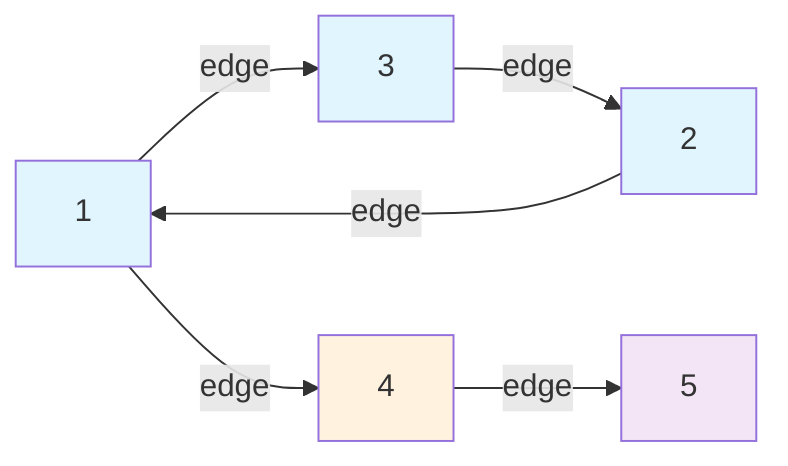
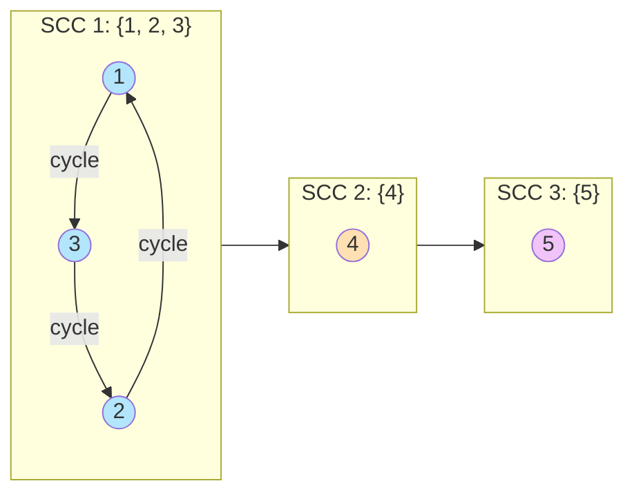
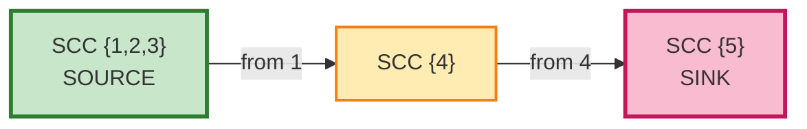

# Kosaraju SCC Algorithm - Test Case Visualization

## Test Input
- **Vertices**: 5 (0-4)
- **Edges**: (1→3), (1→4), (2→1), (3→2), (4→5)
- **Expected SCC**: {1,2,3}, {4}, {5}

---

## 1. Original Graph

**Description**: The original directed graph with 5 vertices and edges forming a cycle between vertices 1, 2, 3.

---

## 2. Strongly Connected Components (SCCs)

**Key Observations**:
- **SCC 1 {1, 2, 3}**: Forms a cycle - all three vertices are mutually reachable
- **SCC 2 {4}**: Single vertex, no cycle
- **SCC 3 {5}**: Single vertex, no cycle

---

## 3. SCC Condensation Graph (DAG)

**Graph Properties**:
- **Source SCC**: {1, 2, 3} - no incoming edges from other SCCs
- **Sink SCC**: {5} - no outgoing edges to other SCCs
- **Intermediate SCC**: {4} - has both incoming and outgoing edges to other SCCs
- **Structure**: Forms a linear DAG chain: SCC1 → SCC2 → SCC3

---

## 5. Algorithm Complexity

| Metric | Value |
|--------|-------|
| Time Complexity | O(V + E) |
| Space Complexity | O(V + E) |
| Number of DFS Passes | 2 |
| Number of SCCs | 3 |

---

## Summary

The Kosaraju algorithm successfully identifies:
- **3 Strongly Connected Components** from a graph with 5 vertices
- **Source**: Component {1,2,3} with no predecessors
- **Sink**: Component {5} with no successors
- **Cycle Detection**: Identifies the cycle 1→3→2→1 as a single connected component
